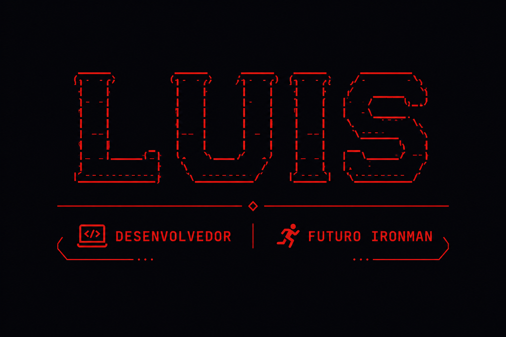

````md
<p align="center">
  
</p>

<p align="center">
  <a href="https://www.instagram.com/luisnanddo">
    
  </a>

  <a href="mailto:77luisnando@gmail.com">
    
  </a>

  <a href="https://www.facebook.com/luisnanddo">
    
  </a>
</p>

---

<p align="center">
  🏥 Desenvolvendo soluções para problemas reais
  &nbsp;&nbsp;♦&nbsp;&nbsp;
  🏃 Futuro IRONMAN
</p>

---

<h2 align="center">⚡ GitHub Stats</h2>

<p align="center">
  
  
</p>

---

<h2 align="center">🛠️ Stack Atual</h2>

<p align="center">


</p>

---

<h2 align="center">🎯 Missões Atuais</h2>

```text
[████████░░] Concluir o curso de Desenvolvimento de Sistemas

[██████░░░░] Aprimorar Java e Back-End

[███████░░░] Evoluir o SC Censo Diário

[████░░░░░░] Tornar-se IRONMAN
````

---

<h2 align="center">🚀 Projetos</h2>

<table align="center">
<tr>
<td width="50%">

### 🏥 SC Censo Diário

Sistema para conferência e organização de prontuários hospitalares.

* Importação XLSX
* Checklist de conferência
* Geração de PDF
* Filtros avançados
* Agrupamento por ala e médic

</td>

<td width="50%">

### 📊 Controle de Gastos

Sistema para gerenciamento financeiro pessoal.

* Controle de despesas
* Categorias personalizadas
* Dashboard financeiro
* Relatórios mensais
* Persistência local

</td>
</tr>
</table>

---

<p align="center">
  
</p>
```
